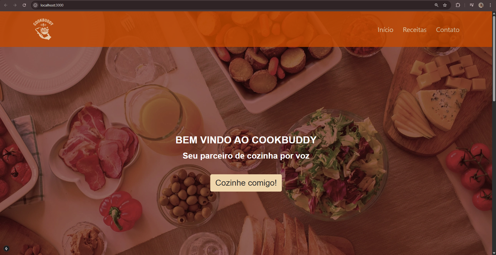
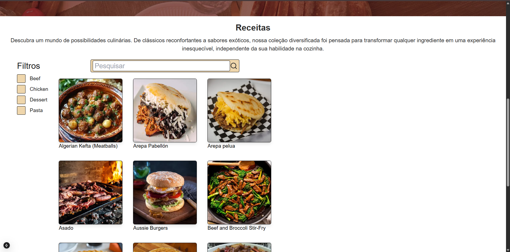
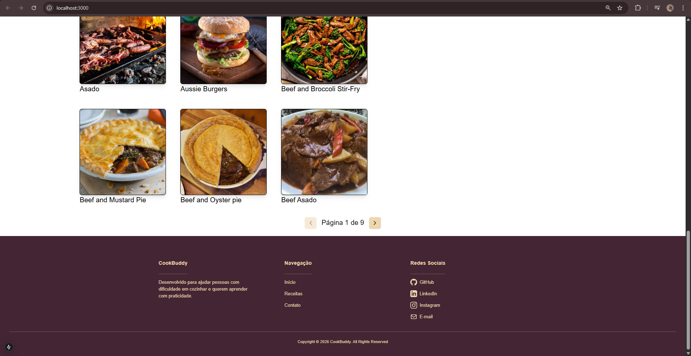

</img>

# CookBuddy: Seu Parceiro de Voz na Cozinha
Alimentar-se é essencial para nossa vida e a cozinha faz parte de tudo isso, só que ela não precisa ser solitária. Assim, o CookBuddy está aqui para lhe acompanhar nas horas em que você se dedica a preparar o que dá sabor à sua vida.  
Essa primeira release foi construída com o objetivo de concluir o desafio do Onboarding (descrito a seguir) e dar o primeiro passo no projeto, então o CookBuddy ainda não possui as funcionalidades de assistente de voz com IA, um sistema de login ou um acervo preparado e próprio de receitas.

## Descrição do projeto  
Esse projeto foi desenvolvido como resolução do desafio 3 da trilha front-end do Onboarding 26.1 da [Seed a Bit Tecnologia](https://seedabit.org.br/). 
Os requisitos do projeto eram, em resumo:
- Uma **Landing Page de entrada**
- Uma **Vitrine de Conteúdo** alimentada por **dados vindos de APIs**
- **Paginação funcional**
- Foco em **organização, integração e fundamentos do framework**

As principais tecbologias utilizadas foram:
- Next.js
- React.js
- Tailwind CSS
- Typescript
- ESLint

## API utilizada
A API utilizada foi a [meal.db](https://www.themealdb.com/). Uma API gratuita que fornece informações completas de refeições, compostas por imagem, título, categoria, dificuldade, origem, ingredientes e modo de preparo. Para os cards presentes na vitrine do projeto, foram necessários da API apenas o id, a imagem e o título das refeições.

## Instruções para execução
Antes de seguir o passo a passo para execução da aplicação, verifique se você tem instalado:
1. **Node Package Manager (NPM)**  
   Para verificar se ele está instalado, use o seguinte comando no terminal:
   ```
   npm --version
   ```
   Se a versão aparecer, ele está instalado.
2. **Node.js**  
   Para verificar se ele está instalado, use o seguinte comando no terminal:
   ```
   node --version
   ```
   Se a versão aparecer, ele está instalado.

1. Clone o repositório do Github para sua máquina  
1.1. No repositório, clique em "code <>"  
1.2. Clique em Download ZIP  
1.3. Extraia o arquivo  
2. Copie o caminho absoluto do arquivo baixado
3. Cole no terminal
   ```
   cd [caminho absoluto do arquivo]
   ```
4. Use o seguinte comando:
   ```
   npm install
   ```
5. Use o seguinte comando:
   ```
   npm run dev
   ```
6. Abra no navegador o link do servidor local que apareceu no terminal, algo como:
   ```
   - Local:        http://localhost:3000
   ```

## Observações técnicas relevantes
### Paginação em Client-Side  
Uma vez que a **API escolhida não tinha paginação em Server-Side**, o fluxo de processamento de dados no projeto baixa todas as receitas de uma determinada categoria ou pordeterminado nome e pagina no Client-Side por meio da função .slice() do TypScript/Javascript.

### Lógica Exclusiva da Barra de Pesquisa e Filtragem  
Sempre que a filtragem é feita, o resultado da pesquisa feita pela barra de pesquisa some, e vice-versa,

### A categoria padrão da vitrine é a "beef"  
Por isso, em um primeiro momento de uso da aplicação o filtro "beef" parece não funcionar.

## Screenshots da Execução da Aplicação
</img>
</img>
</img>
